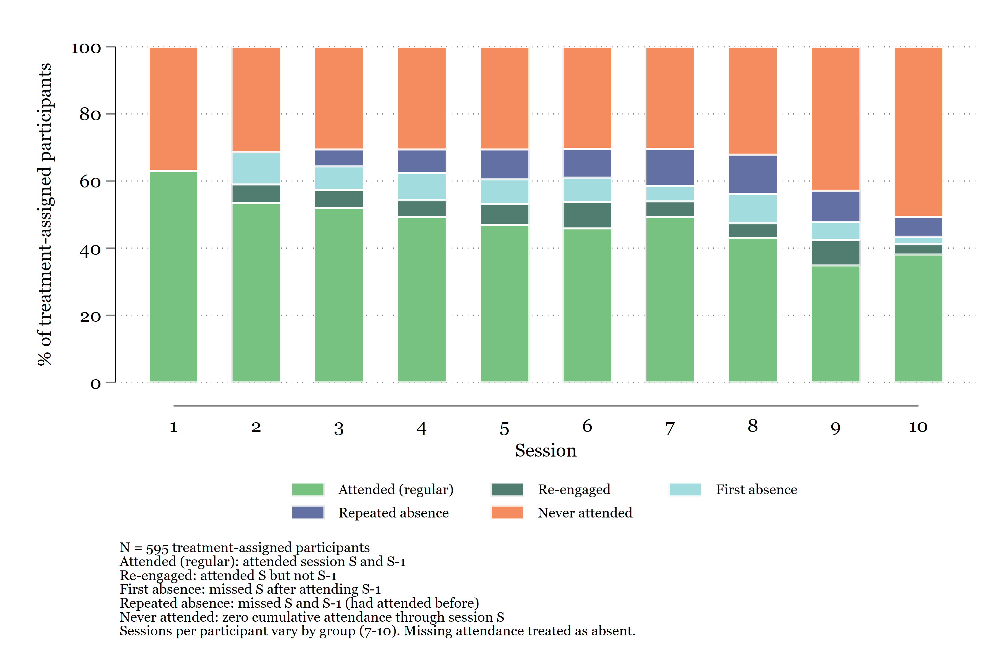
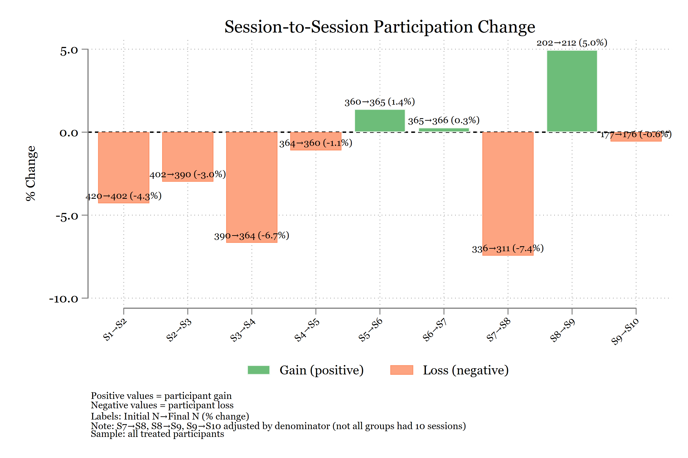
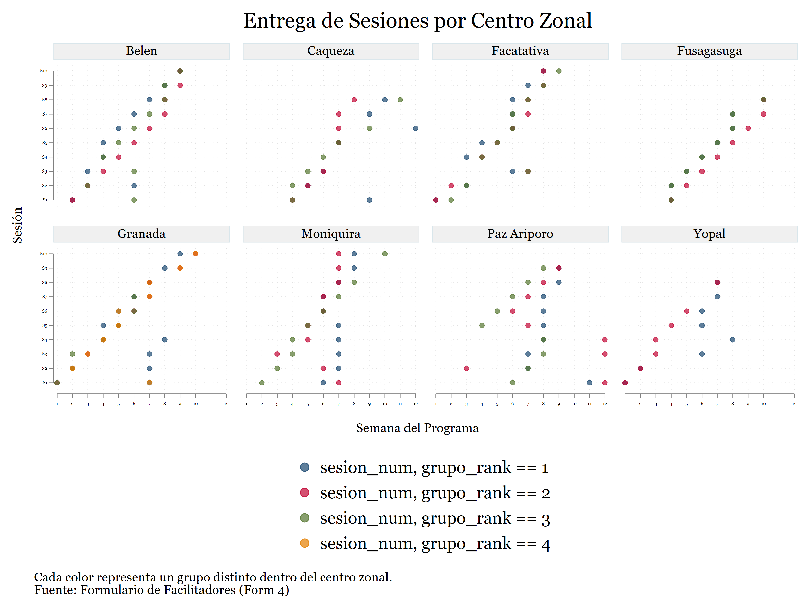

Todo lo que se muestra en esta pagina fue construido con Claude Code en un proyecto real de IPA Colombia. No son demos — son entregables que se compartieron con donantes, equipos de investigacion y socios de implementacion.

Claude Code no hizo estos productos solo. En todos los casos, defini la especificacion, revise cada output, y tome las decisiones analiticas. Pero Claude Code transformo tareas que tomaban dias en tareas de horas.

---

## Un pipeline completo de analisis MEL

El resultado mas ambicioso: un pipeline de 12 scripts de Stata que produce automaticamente todas las tablas, graficos y analisis del reporte de Monitoreo, Evaluacion y Aprendizaje (MEL) de un programa con 600+ participantes en 8 municipios.

Un solo comando ejecuta todo el pipeline:

```bash
just stata-run   # Corre los 12 scripts en secuencia
```

El pipeline incluye: limpieza de datos de asistencia, analisis de desercion, barreras de participacion, fidelidad de implementacion, calidad de sesiones, y analisis de dosis-respuesta. Claude Code escribio y depuro la mayoria de estos scripts iterativamente — yo definia la especificacion analitica, el generaba el codigo, yo revisaba los resultados y pedia ajustes.

### Algunos graficos producidos por el pipeline







---

## Presentaciones generadas programaticamente

Las presentaciones de resultados no se hacen manualmente en PowerPoint — se generan con un script de Node.js que usa la libreria pptxgenjs. Claude Code ayudo a disenar todo el sistema:

- Un script de ~1,000 lineas con funciones reutilizables: `topbar()`, `footer()`, `sidebar()`, `callout()`, `table()`
- Colores y tipografia IPA aplicados automaticamente
- Las tablas de Stata alimentan directamente las diapositivas

El flujo es: Stata genera tablas → el script de Node.js las lee → produce un `.pptx` listo para presentar. Cuando se actualizan los datos, se regenera la presentacion completa sin editar una sola diapositiva manualmente.

---

## Un sistema de instrucciones para que Claude trabaje autonomamente

Quizas lo mas util a largo plazo: Claude Code no necesita que le explique el proyecto cada vez que inicio una sesion. Tres documentos le dan contexto persistente:

**`CLAUDE.md`** — El briefing del proyecto. Define las dos muestras (COMPLETA para monitoreo, RCT para impacto), el mapa del pipeline, las reglas de PII, las convenciones de codigo, y los globals de rutas.

**`CLAUDE_STATA_GUIDE.md`** — Le ensena a Claude como ejecutar Stata en este proyecto. Incluye la instruccion de ejecutar scripts autonomamente despues de editarlos, leer el log, y reportar resultados sin esperar a que se lo pidan.

**`CLAUDE_DELIVERABLES_GUIDE.md`** — Documenta el pipeline de Stata a LaTeX: patrones de `esttab`/`outreg2`, colores IPA para graficos, compilacion de tablas, y analisis de sensibilidad.

El resultado: cuando pido "corre el script de desercion y dime si paso", Claude Code ejecuta el script, lee el log, identifica si hubo errores, reporta los coeficientes clave, y me dice donde guardo los outputs. Si falla, diagnostica el error y lo corrige antes de reportar.

---

## Skills personalizados

Mas alla del proyecto, construi skills reutilizables que Claude Code carga automaticamente:

- **Skill de Stata**: estandares IPA/DIME, headers de do-files, cuatro etapas del flujo de datos (importar, desidentificar, limpiar, construir), convenciones de valores faltantes extendidos
- **Skill de escritura IPA**: reglas de estilo, voz activa, acronimos, formato de citas, terminologia preferida
- **Skill de presentaciones**: framework para generar `.pptx` programaticamente con marca IPA

Estos skills funcionan en cualquier proyecto — no son especificos de un solo estudio.

---

## Que tienen en comun estos ejemplos

1. **La especificacion siempre fue mia.** Claude Code no decide que analizar ni como presentarlo.
2. **El valor esta en la velocidad de ejecucion.** Escribir do-files, generar tablas, depurar errores, formatear graficos — ahi es donde mas tiempo ahorra.
3. **Todo es reproducible.** Un comando regenera todo. No hay edicion manual.
4. **Nada salio bien a la primera.** El ciclo fue siempre: pedir → revisar → ajustar → repetir.
